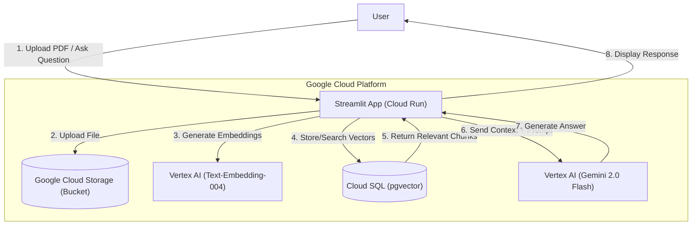

# RAG Vertex GCP – Enterprise RAG with Cloud SQL & Vertex AI

This project is a scalable, cloud-native **Retrieval-Augmented Generation (RAG)** pipeline built entirely on **Google Cloud Platform (GCP)**. Unlike local implementations, this solution uses **Cloud SQL (PostgreSQL + pgvector)** for persistent vector storage and **Google Cloud Storage (GCS)** as the source of truth for documents.

The application allows users to upload documents (PDF/TXT) via a **Streamlit** interface hosted on **Cloud Run**. Files are automatically backed up to a GCS bucket, embedded using **Vertex AI**, and indexed for semantic search.

# Table of Contents

- [RAG Vertex GCP – Enterprise RAG with Cloud SQL & Vertex AI](#rag-vertex-gcp--enterprise-rag-with-cloud-sql--vertex-ai)
  - [Key Features](#key-features)
  - [System Architecture](#system-architecture)
  - [Prerequisites](#prerequisites)
  - [Deployment Option 1: Run Locally (Testing)](#deployment-option-1-run-locally-testing)
  - [Deployment Option 2: Deploy to Cloud Run (Production)](#deployment-option-2-deploy-to-cloud-run-production)
  - [Batch Ingestion (CLI)](#batch-ingestion-cli)
  - [Configuration](#configuration)
  - [Troubleshooting Guide](#troubleshooting-guide)
  - [Frequently Asked Questions (FAQ)](#frequently-asked-questions-faq)
  - [Future Improvements](#future-improvements)

---

# Key Features

| Feature | Description |
| :--- | :--- |
| **Serverless Deployment** | Containerized with **Docker** and deployed on **Google Cloud Run** for auto-scaling and zero server management. |
| **Persistent Vector DB** | Uses **Cloud SQL (PostgreSQL)** with the `pgvector` extension, enabling production-grade vector similarity search. |
| **Cloud Storage Sync** | Every uploaded document is securely stored in a **GCS Bucket**, serving as the single source of truth for your data. |
| **Vertex AI Integration** | Powered by Google's **Gemini 2.0 Flash** for generation and `text-embedding-004` for state-of-the-art embeddings. |
| **Performance Optimized** | Implements database connection pooling and batched embedding requests to handle high traffic efficiently. |
| **Secure Connectivity** | Connects to the database using the **Cloud SQL Auth Proxy** (Unix Sockets), ensuring no public IP exposure is required. |
| **PDF & Text Support** | Native support for parsing PDF documents and text files with intelligent chunking logic. |

---

# System Architecture

The architecture is designed for persistence and scalability. It decouples storage (GCS/SQL) from the compute (Cloud Run), allowing the application to restart or scale without losing data.



---
Prerequisites
1.  Google Cloud Project: An active GCP project with billing enabled.

2.  APIs Enabled:

    Vertex AI API

    Cloud Run API

    Cloud Build API

    Cloud SQL Admin API

3.  Cloud SQL Instance:

    PostgreSQL 15+

    `vector` extension installed (`CREATE EXTENSION vector;`).

GCS Bucket: A standard bucket for storing document files.

# gcloud CLI: Installed and authenticated on your local machine.
---
Deployment Option 1: Run Locally (Testing)
You can run the app on your laptop while connecting to the cloud services.

1. Clone the Repository
```
git clone [https://github.com/Raza-Ammad/rag-vertex-gcp.git](https://github.com/Raza-Ammad/rag-vertex-gcp.git)
cd rag-vertex-gcp
```
2. Environment Setup
```
python3 -m venv venv
source venv/bin/activate  # Windows: venv\Scripts\activate
pip install -r requirements.txt
```
3. Authenticate
```
gcloud auth application-default login
```
4. Run the App
Set your environment variables (replace with your actual values) and start Streamlit:
```
export GCP_PROJECT="your-project-id"
export GCS_BUCKET_NAME="your-bucket-name"
export DB_HOST="your-db-public-ip"  # Ensure your IP is whitelisted in Cloud SQL
export DB_PASSWORD="your-db-password"

streamlit run rag_streamlit.py
```
---

# Deployment Option 2: Deploy to Cloud Run (Production)
This is the recommended method for a production-ready deployment.

1. Create the Dockerfile
Ensure your `Dockerfile` and `.gcloudignore` are present in the root directory.

2. Build the Image
Submit the build to Google Cloud Build:
```
gcloud builds submit --tag gcr.io/YOUR_PROJECT_ID/rag-vertex-app
```
3. Deploy Service
Deploy to Cloud Run, connecting securely to Cloud SQL via the Auth Proxy.

Note: Replace `YOUR_CONNECTION_NAME` with the value from `gcloud sql instances list --format="value(connectionName)"`.
```
gcloud run deploy rag-vertex-app \
  --image gcr.io/YOUR_PROJECT_ID/rag-vertex-app \
  --platform managed \
  --region us-central1 \
  --allow-unauthenticated \
  --add-cloudsql-instances "YOUR_CONNECTION_NAME" \
  --set-env-vars GCP_PROJECT="YOUR_PROJECT_ID" \
  --set-env-vars GCS_BUCKET_NAME="YOUR_BUCKET_NAME" \
  --set-env-vars DB_HOST="127.0.0.1" \
  --set-env-vars DB_PORT="5432" \
  --set-env-vars DB_NAME="ragdb" \
  --set-env-vars DB_USER="postgres" \
  --set-env-vars DB_PASSWORD="YOUR_DB_PASSWORD"
```
---
Batch Ingestion (CLI)
If you have existing files in your Google Cloud Storage bucket that haven't been indexed yet, you can run the batch ingestion script.
```
# Set your bucket name
export GCS_BUCKET_NAME="your-bucket-name"

# Run the ingestion
python3 ingest_gcs.py
```
This script will:

1.  Connect to the specified bucket.

2.  Download every `.pdf` and `.txt` file.

3.  Chunk and embed the content.

4.  Upsert the vectors into Cloud SQL (preventing duplicates via URI checks).
---
# Configuration
```
Variable            Description                                             Example

GCP_Project       Required. The ID of your Google Cloud Project.            starry-journal-480011
GCS_BUCKET_NAME   Required. Name of the bucket to store/read docs.          rag-docs-raza
DB_HOST           Required. DB IP (Local) or Socket path (Cloud Run).       127.0.0.1 or /cloudsql/...
DB_NAME           Required. Name of the Postgres database.                  ragdb
DB_USER           Required. Postgres username.                              postgres
DB_PASSWORD       Required. Postgres password.                              Secr3tPass!
GCP_LOCATION      Optional. Region for Vertex AI.                           us-central1
```
---
# Troubleshooting Guide
```
Symptom                    Diagnostic Step                                     Solution

Connection Refused(5432)   Occurs on Cloud Run logs.                          Ensure DB_HOST is set to /cloudsql/YOUR_CONNECTION_NAME if using Unix sockets, or check if the SQL Proxy sidecar failed to start.
ModuleNotFoundError        "No module named 'streamlit'" or 'PyPDF2'.          Add the missing library to requirements.txt and rebuild the Docker image using gcloud builds submit.
Authentication Error       "Could not automatically determine credentials".    On Local: Run gcloud auth application-default login. On Cloud Run: Ensure the Service Account has Vertex AI User and Cloud SQL Client roles.
Empty Context              The app returns answers without "Sources".          Check if the documents were actually ingested. Use ingest_gcs.py to re-index or check the table SELECT count(*) FROM documents;. 

```
---
# Frequently Asked Questions (FAQ)
```
Question                                Answer

Is this production ready?               Yes, the architecture (Cloud Run + Cloud SQL) is production-grade. However, you should disable --allow-unauthenticated and set up IAM or a login screen for true security.
Why use Cloud SQL over FAISS?           FAISS is fast but local/in-memory. Cloud SQL persists data, allowing multiple users to query the same index simultaneously and enabling the app to scale down to zero without data loss.
How much does this cost?                You pay for Cloud Run (CPU/Memory only while running), Cloud SQL (hourly instance cost), and Vertex AI (per character/image processed).
Can I upload Word Docs?                 Currently, only .pdf and .txt are supported. You can extend rag_streamlit.py to support .docx using python-docx.

```
---
# Future Improvements

### Authentication: 
    Add Google OAuth 2.0 to restrict access to specific users within the organization.

### Hybrid Search: 
    Implement PostgreSQL full-text search (tsvector) alongside vector search for better keyword matching.

### Infrastructure as Code: 
    Convert the deployment commands into Terraform scripts for automated infrastructure setup.

### Chat History: 
    Store user conversation history in a separate Cloud SQL table to enable multi-turn conversations.


